# meilisearch_mcp
专为Trovelocal项目打造的mcp服务器。

目前提供meilisearch查询，通过meilisearch为大模型提供私人知识库的专有知识，提升大模型解决专业领域问题的能力。

## 使用

- 修改utils.py中的meilisearch服务器地址和api_key（MEILI_URL、MEILI_API_KEY）。

- 运行meili_mcp.py

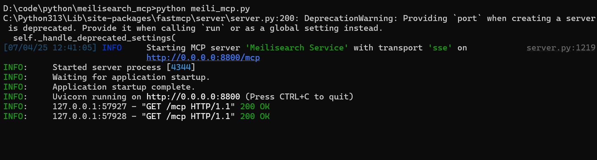

- 添加mcp服务器到客户端工具。下面以vscode+cline为例。

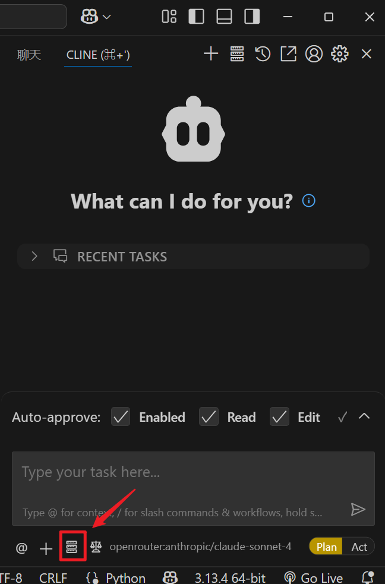

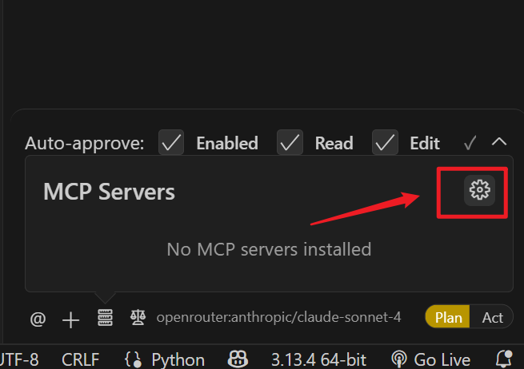

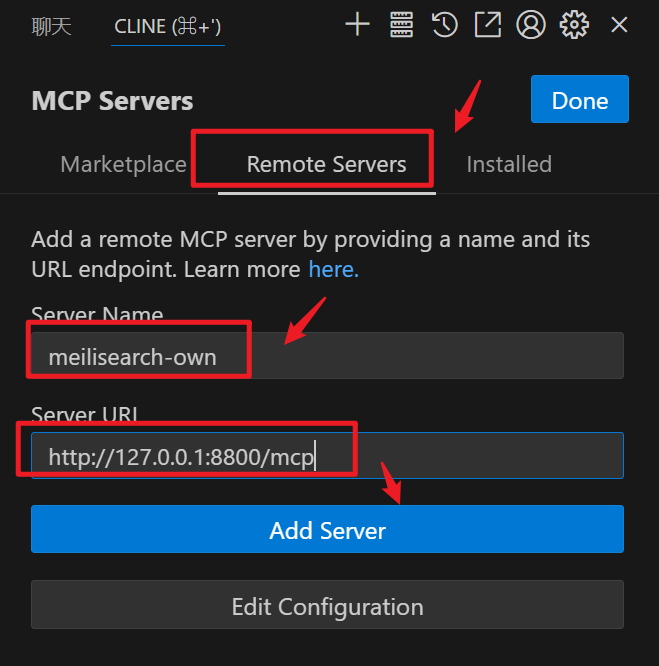

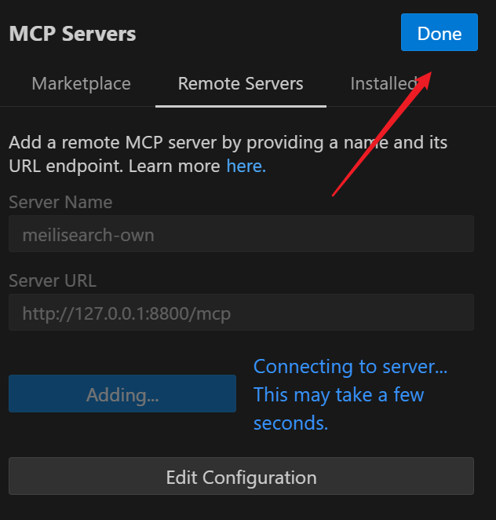

添加成功后，把模式切换为Act：

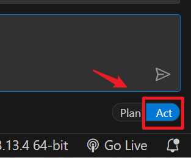

开始提问。

### 问1：刑法第二十条

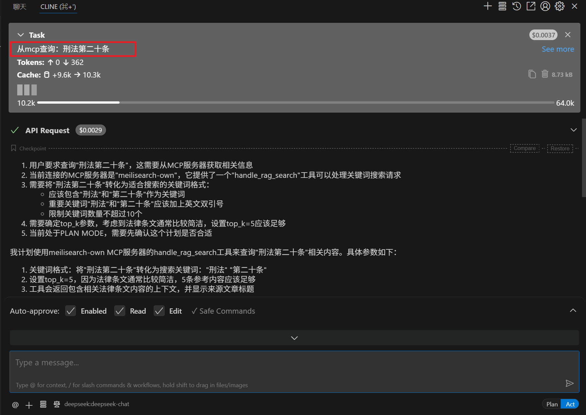

回答：

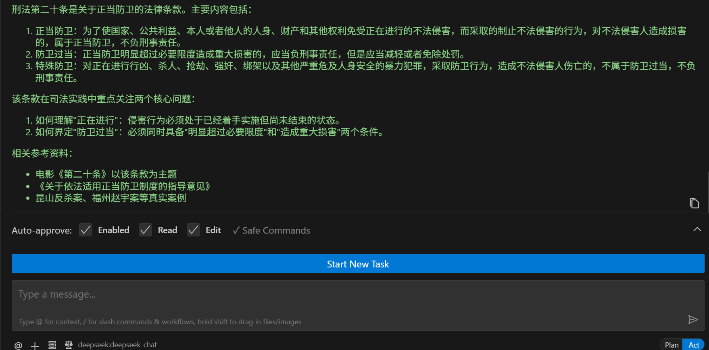

继续追问： 从mcp查询：有没有具体案例？

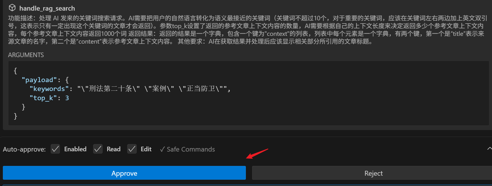

回答的都是知识库中存储的知识：

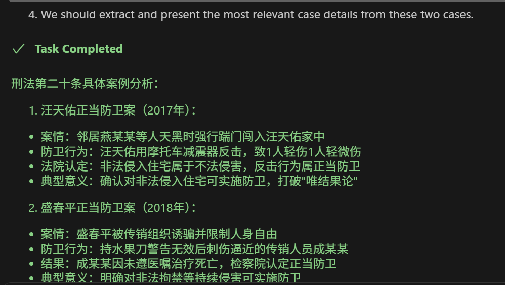

### 问2：fortigate版本识别有什么办法

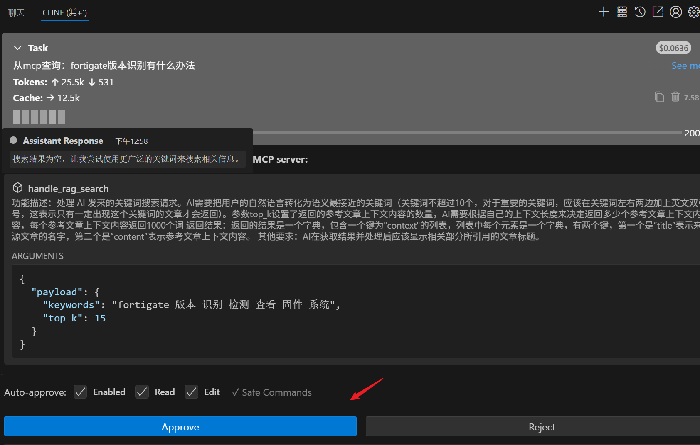

回答：

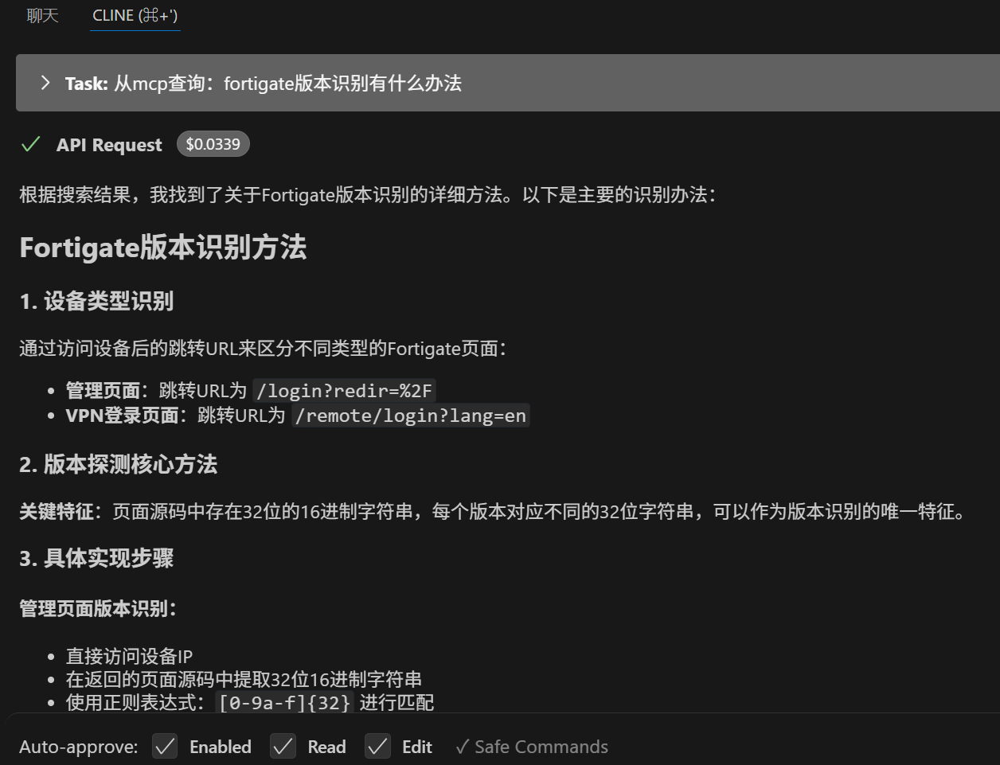

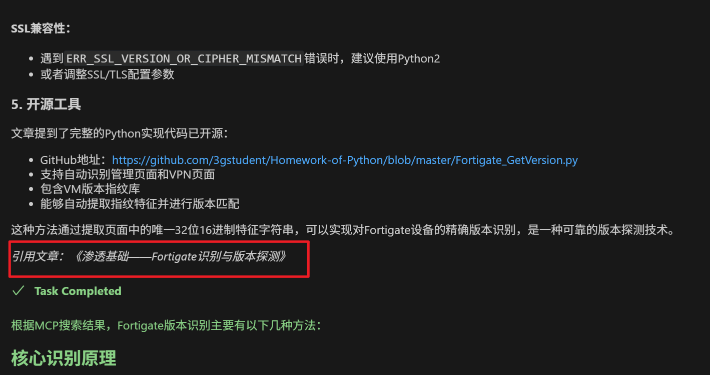
